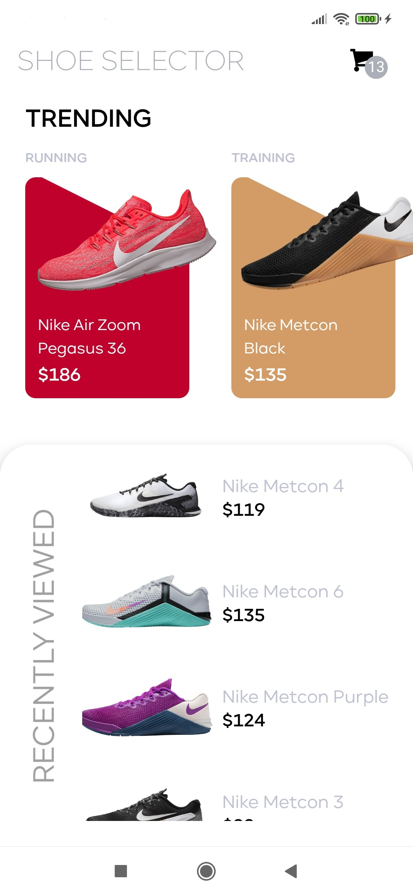
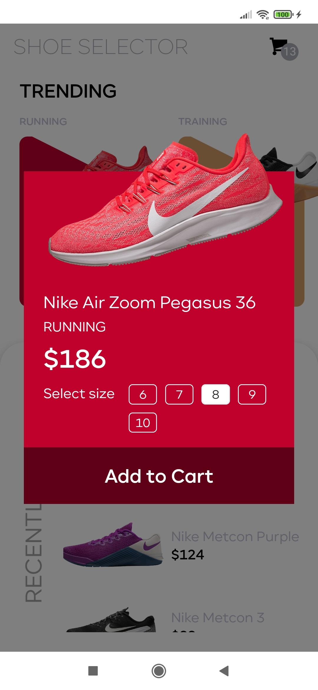
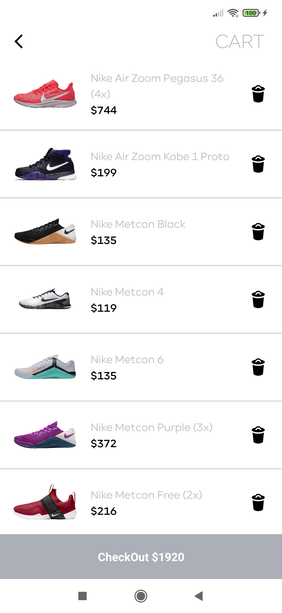

<h1 align="center">Nike Shoes Store</h1>

  
  &nbsp; &nbsp; &nbsp; &nbsp;
   
    &nbsp; &nbsp; &nbsp; &nbsp;
  

<h2 align="center">A fake store app with nike shoes to put in the cart just for fun. There is a trending and recent views session. You can also select your shoe size and check your cashout later.
</h2>

## ⚙️ Technologies

- [ ] Javascript
- [ ] React Js
- [ ] React Native
- [ ] React Native Navigation
- [ ] Expo
- [ ] Redux

# Running React Native and Expo application

Install the Expo Go app on your iOS or Android phone and connect to the same wireless network as your computer. On Android, use the Expo Go app to scan the QR code from your terminal to open your project. On iOS, use the built-in QR code scanner of the default iOS Camera app.

In the project directory, you just need to run:

### `npm install`

To install the node_modules and all dependeces.

### `npm start`

This will start a development server for you.
